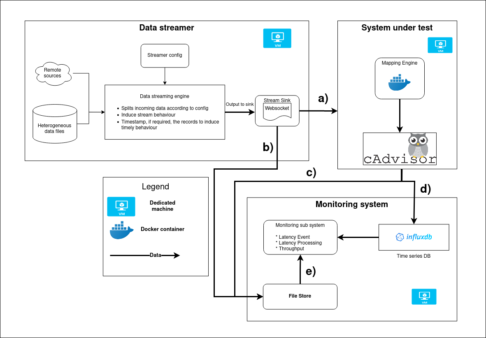

# RMLStreamer benchmark suite 


RMLStreamer benchmark consists of 3 major components. 
* Data streamer 
* System under test (SUT) 
* Monitoring unit

All 3 components are setup in a containerized environment using docker. 
The architecture for the docker setup is influenced by [RSPLab](https://github.com/streamreasoning/rsplab) [Riccardo T.]. 
This repo is available as open-source under the MIT License. 




# Run the evaluation 

The following command executes the scripts which will automatically start 
the data streamer, the specified SUT for evaluation 
and the collection of the metrics. The script will also ensure that the
components have to ensure that the metrics 
collection do not start too early.  

`./start.sh -e [SUT folder name] -- [CLI args for SUT]`

CLI args for SUT are the args required by the SUT to run a mapping job. 
Check the documentation of the relevant SUTs for the required arguments 
to run them. 


# Components

Information on running the scripts, the configuration and the workings of
each components can be found at their relevant pages/repos. 

* [Data streamer repo](https://github.com/s-minoo/datastreamer-rust)
* [SUT](engine/README.md)
* [Monitoring unit](collector/README.md)
  

# General structure 
The components are structured according to the following the file hierarchy:

```
root 
|  start.sh
|  stop.sh
|_____datastreamer 
|     |   start.sh 
|     |   stop.sh
|     |   ....
|_____engine
|     |   start.sh 
|     |   stop.sh
|     |   ....
|     |_____rml-streamer 
|           |  start.sh 
|           |  stop.sh
|           |  ....
|_____collector
      |   start.sh 
      |   stop.sh
      |   ....
```


The `start.sh` scripts are the entry scripts to start the relevant 
components/engines. 
The `stop.sh` scripts starts the shutdown procedure for the relevant 
components/engines. It should also be responsible for the removal of 
any resources used by the components. 


# Adding your own engine to the benchmark 
In order to add another engine to evaluate with this benchmark framework, 
add another engine-specific folder under the `engine` 
folder. The entry script to start the engine should be named `start.sh`. 


# Other infos

### **Wait-for-it.sh**
The `wait-for-it.sh` script will block the execution of script wth a
timeout waiting for the specified port at the given host to be open. 
The script can be run as follows: 
`./wait-for-it.sh  [hostname:port] -t [seconds] `


