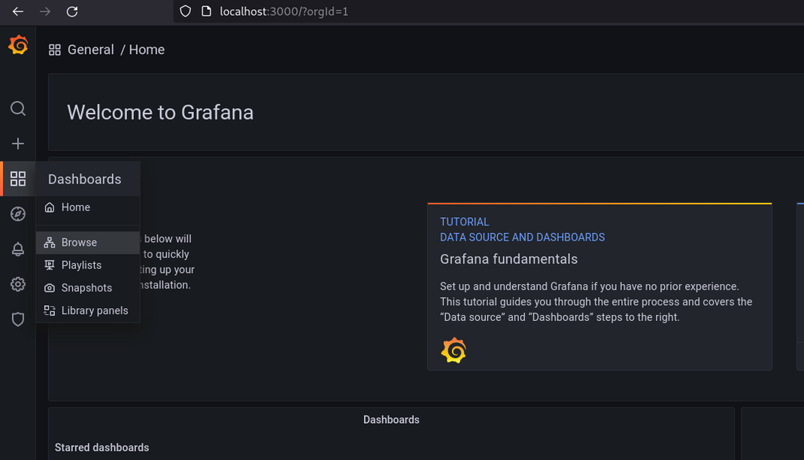
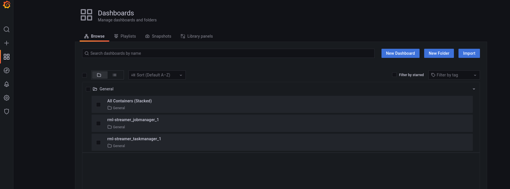

# Credits
This readme is the same as the one [RSPLab](https://github.com/streamreasoning/rsplab/tree/tutorial/collector). 

# Docker Container Monitoring

Monitor real-time and historical memory, cpu, and network usage of your Docker containers.


Connect Grafana to InfluxDB & Share Team Dashboards
---------------------------------------------------

Once cAdvisor is writing to InfluxDB, you'll need to configure
Grafana to connect to InfluxDB, then load up your team's shared
Dashboards.

[create-dashboareds.sh](create-dashboards.sh) ensures that an InfluxDB
database and user exists, that Grafana has a data store that points
to it, and all Grafana dashboards are created.

Read [create-dashboards.README.md](create-dashboards.README.md) for details.


Try It Out!
-----------


Try out the "All Containers (Stacked)" dashboard, which shows the CPU, memory,
and network activity for all of your Docker containers. 

**Note about Container Network Usage:** if you use `--net=host` option in Docker, 
each container is reporting all traffic on the shared network interface, so you'll 
lose per-container visibility. You'll need to click on a single container to see 
the proper sum of all.

1. Start your monitoring Docker cluster. The first time you run this might
take a little while, since Composer will need to download Docker images
from the [Docker Hub](https://registry.hub.docker.com/search):

      ```
      docker-compose up
      ```
2. Wait 10 seconds, so the services have time to start.

3. Run this command, which will set up Grafana to talk with InfluxDB,
and create dashboards for any existing Docker containers:

      ```
      ./create-dashboards.sh
      ```
4. View your new Grafana dashboard at [http://localhost:3000](http://localhost:3000) with admin/admin


5. View your new cAdvisor realtime performance monitoring dashboard at

  [http://localhost:9090](http://localhost:9090).


6. Query for specific metrics using your new InfluxDB instance at [http://localhost:8083](http://localhost:8083).


7. Re-run the shell script at any point, to create dashboards for all of the currently-running Docker containers

    ```
    ./create-dashboards.sh
    ```

# Viewing the Grafana dashboards 
The dashboards are automatically created for the engines once they're started. 

They could be accessed from the grafana homepage by first going to the "Dashboards" tab and clicking on the "Browse" link.



The generated dashboards would be shown in a list as shown below: 



# Collecting metrics to CSV 

A script is provided to collect the results of the evaluation into csv 
files. **Note: this script should be run first before stopping the evaluation!** 

The following command runs the collection script: 

`./collect.sh [engine_container_name]`

You need to provide the name of the container of the engine to collect
the metrics. 